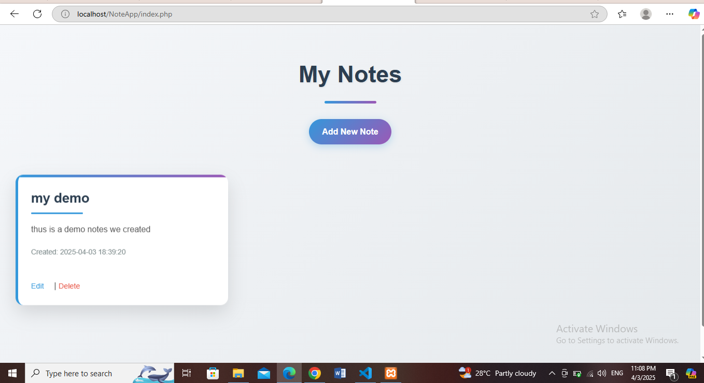

# 📝 Note App  
A simple **Note-Taking App** built using **PHP, MySQL, HTML, CSS, and JavaScript**.




## 🚀 Features  
✅ Create, edit, and delete notes  
✅ Stores notes in a MySQL database  
✅ User-friendly interface with Bootstrap  
✅ Fully responsive design  

## ⚙️ Technologies Used  
- **Frontend:** HTML, CSS, JavaScript, Bootstrap  
- **Backend:** PHP, MySQL  
- **Database:** MySQL  

## 🔧 Installation  
### Step 1: Clone the Repository  
```sh
git clone https://github.com/your-username/NoteApp.git
cd NoteApp
